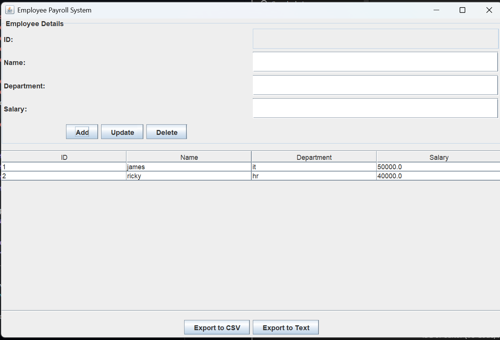

Employee Payroll System

A Java Swing-based desktop application for managing employee records, including adding, updating, deleting, and exporting payroll data. Stores data locally and provides CSV and text export functionality.

Image:

📝 Features

Add, update, and delete employees

Stores ID, Name, Department, and Salary

Persist data locally in employees.dat

Export employee data to CSV (employees.csv) or formatted text report (employees.txt)

Table view with selection and editable fields

Automatic ID assignment

Real-time updates reflected in the table

💻 Getting Started
Prerequisites

Java JDK 8 or higher

IDE or editor (VS Code, IntelliJ IDEA, Eclipse)

Clone the Repository
git clone https://github.com/IneshAg/Employee-Payroll-System.git
cd Employee-Payroll-System

Compile and Run
Using Terminal:
javac -d bin EmployeePayrollSystem.java
java -cp bin EmployeePayrollSystem

Using IDE:

Open the project in your IDE.

Compile and run EmployeePayrollSystem.java.

📂 Project Structure
Employee-Payroll-System/
├─ EmployeePayrollSystem.java   # Main payroll system
├─ employees.dat                # Persistent employee data
├─ employees.csv                # Exported CSV (generated)
├─ employees.txt                # Exported text report (generated)
└─ README.md

⚙️ How It Works

On launch, existing employee data is loaded from employees.dat.

Users can add new employees by filling in Name, Department, and Salary.

Select an employee from the table to update or delete their record.

Employee data is automatically saved after changes.

Export options:

CSV: Simple comma-separated format

Text: Formatted report with totals and averages

🎯 Key Classes

EmployeePayrollSystem – Main class handling GUI and CRUD operations

Employee – Represents individual employee records

📌 Future Improvements

Add department-wise salary summaries

Include search and filter functionality

Integrate database support for large datasets

Add authentication for secure access

Add graphical reports and charts

🛠️ License

This project is open-source and free to use for educational purposes.